# End-to-End Warehouse Business Process

## Control Markers

- **[APPROVAL]** — Requires manager approval
- **[INTEGRATION]** — Connects with another system
- **[SCHEDULED]** — Happens on a planned schedule
- **[HUMAN ESCALATION]** — Requires help from a manager

## Process Map

```mermaid
flowchart TD
    START(["Start: Goods or customer order enters the warehouse process"])

    R["1. Receiving<br/>Owner: Warehouse Associate<br/>Input: Incoming shipment and purchase order<br/>Output: Receiving record"]
    RD{"Items are undamaged<br/>and quantities are correct?"}

    P["2. Putaway<br/>Owner: Warehouse Associate<br/>Input: Received products and available locations<br/>Output: Products stored and locations updated"]
    PD{"Is the selected storage<br/>location correct and available?"}

    C["3. Cycle Counting [SCHEDULED] [APPROVAL]<br/>Owner: Inventory Controller<br/>Input: Count schedule and system inventory<br/>Output: Verified count or adjustment request"]
    CD{"Does physical inventory<br/>match the system?"}

    RE["4. Replenishment [SCHEDULED]<br/>Owner: Inventory Controller<br/>Input: Low-stock alert and reserve stock<br/>Output: Picking location restocked"]
    RED{"Is enough reserve<br/>stock available?"}

    PI["5. Picking<br/>Owner: Warehouse Associate<br/>Input: Approved order and pick list<br/>Output: Products collected for the order"]
    PID{"Are the correct products<br/>and quantities picked?"}

    PA["6. Packing<br/>Owner: Warehouse Associate<br/>Input: Picked products and packing instructions<br/>Output: Sealed and labeled package"]
    PAD{"Are the products, packaging,<br/>and shipping label correct?"}

    S["7. Shipping [INTEGRATION]<br/>Owner: Logistics Coordinator<br/>Input: Packed order, address, and carrier details<br/>Output: Shipment record, tracking number, and status"]
    SD{"Did the carrier accept<br/>the shipment?"}

    X["8. Exception Handling [APPROVAL] [HUMAN ESCALATION]<br/>Owner: Operations Manager<br/>Input: Failure or exception record<br/>Output: Corrective action and resolution record"]
    XD{"Can the issue be resolved?"}

    FIX["Correct the issue, update the record,<br/>and complete the remaining work"]
    ESC["Escalate to Operations Manager<br/>and request approval"]
    END(["End: Shipment completed and records updated"])

    START --> R --> RD
    RD -- Yes --> P --> PD
    PD -- Yes --> C --> CD
    CD -- Yes --> RE --> RED
    RED -- Yes --> PI --> PID
    PID -- Yes --> PA --> PAD
    PAD -- Yes --> S --> SD
    SD -- Yes --> END

    RD -- "No: damaged, missing, or incorrect goods" --> X
    PD -- "No: wrong or full location" --> X
    CD -- "No: inventory difference" --> X
    RED -- "No: insufficient reserve stock" --> X
    PID -- "No: missing or wrong product" --> X
    PAD -- "No: damage or incorrect label" --> X
    SD -- "No: carrier rejection or delay" --> X

    X --> XD
    XD -- Yes --> FIX --> END
    XD -- No --> ESC --> X
```

## Phase Summary

| Phase | Owner | Main Decision | Possible Failure |
|---|---|---|---|
| Receiving | Warehouse Associate | Do items and quantities match? | Damaged, missing, or incorrect goods |
| Putaway | Warehouse Associate | Is the storage location correct and available? | Wrong or full storage location |
| Cycle Counting | Inventory Controller | Does physical inventory match the system? | Inventory difference |
| Replenishment | Inventory Controller | Is enough reserve stock available? | Insufficient stock |
| Picking | Warehouse Associate | Were the correct products and quantities picked? | Missing or wrong product |
| Packing | Warehouse Associate | Is the package and label correct? | Damage or incorrect label |
| Shipping | Logistics Coordinator | Did the carrier accept the shipment? | Carrier rejection or delay |
| Exception Handling | Operations Manager | Can the issue be resolved? | Unresolved or repeated issue |
